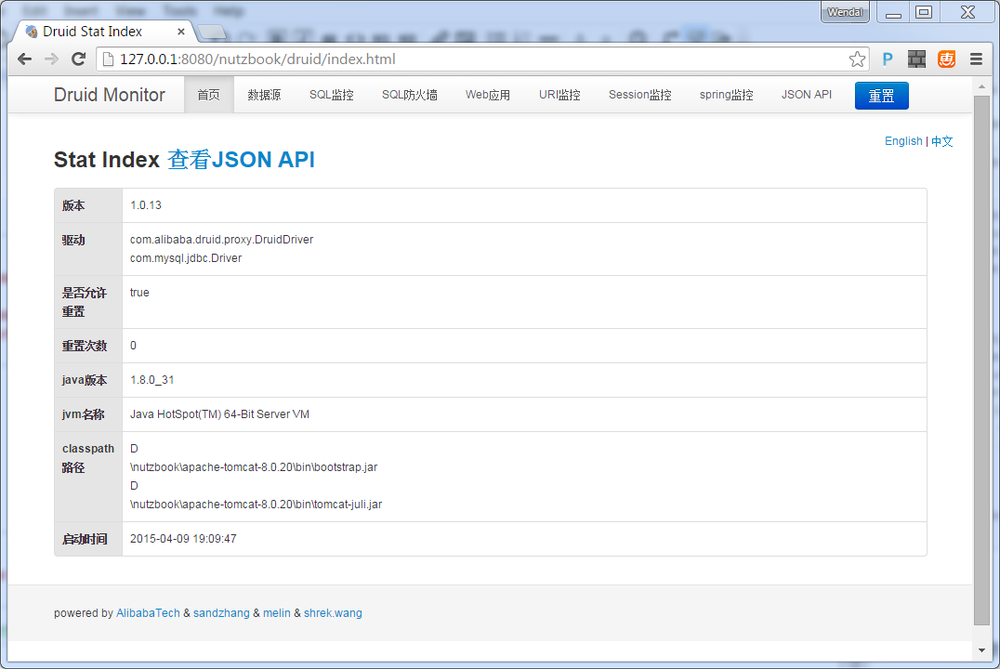

# 配置druid监控

## 打开dao.js, 为DruidDataSource加入监控选项, 分别是filters和connectionProperties

```js
	        fields : {
	            url : {java:"$conf.get('db.url')"},
	            username : {java:"$conf.get('db.username')"},
	            password : {java:"$conf.get('db.password')"},
	            testWhileIdle : true,
	            validationQuery : {java:"$conf.get('db.validationQuery')"},
	            maxActive : {java:"$conf.get('db.maxActive')"},
	            filters : "mergeStat",
	            connectionProperties : "druid.stat.slowSqlMillis=2000"
	        }
```

### filters是druid定义的一些过滤器,mergeStat是带合并的sql状态过滤器, 而connectionProperties配置中的2000代表如果sql执行超过2秒,就输出日志

## 打开web.xml, 在nutz的filter之前, 加入Web监控的配置

```xml
	<filter>
		<filter-name>DruidWebStatFilter</filter-name>
		<filter-class>com.alibaba.druid.support.http.WebStatFilter</filter-class>
		<init-param>
			<param-name>exclusions</param-name>
			<param-value>*.js,*.gif,*.jpg,*.png,*.css,*.ico,/druid/*,/rs/*</param-value>
		</init-param>
	</filter>
	<filter-mapping>
		<filter-name>DruidWebStatFilter</filter-name>
		<url-pattern>/*</url-pattern>
	</filter-mapping>
```

## 在welcome-file之前,再加入

```
	<servlet>
		<servlet-name>DruidStatView</servlet-name>
		<servlet-class>com.alibaba.druid.support.http.StatViewServlet</servlet-class>
	</servlet>
	<servlet-mapping>
		<servlet-name>DruidStatView</servlet-name>
		<url-pattern>/druid/*</url-pattern>
	</servlet-mapping>
```

### 本章结尾会提供当前项目的压缩包,如果不明白就下载压缩包看看吧

## 启动tomcat,先尝试登陆登出一次,然后访问如下地址观察效果

查看web统计信息

```
http://127.0.0.1:8080/nutzbook/druid/webapp.html
```

查询数据库操作的统计信息

```
http://127.0.0.1:8080/nutzbook/druid/sql.html
```

