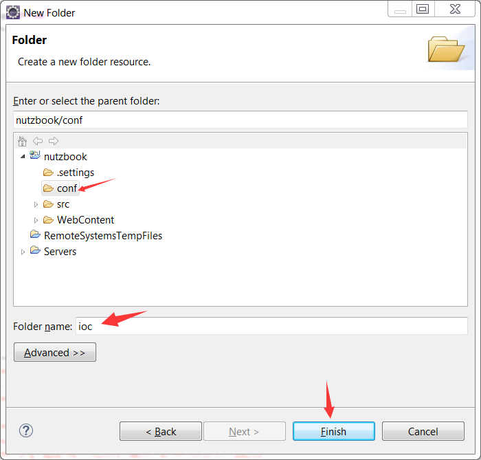
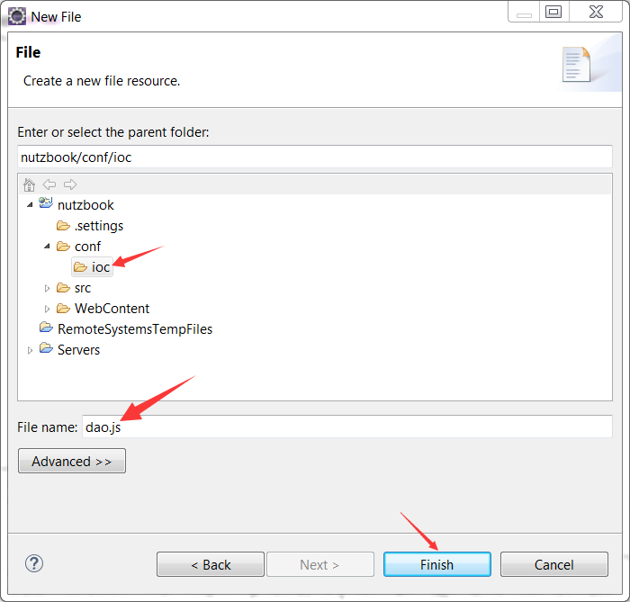
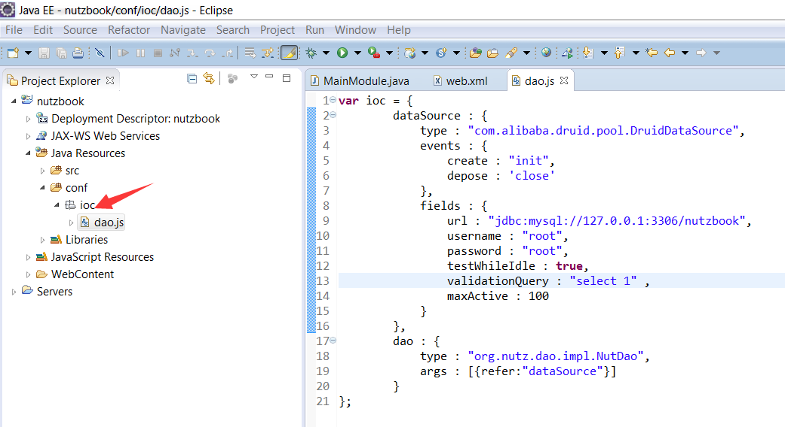

# 添加dao.js

提前提醒一下,这个文件重要的是后缀不能错,名字写成abc.js对程序运行没影响.

## 点一下项目中的conf目录,然后Ctrl+N,选择General->Floder,弹出新建文件夹对话框,新建一个文件夹叫ioc



## 点一下项目中的conf目录,然后Ctrl+N,选择General->File,弹出新建文件对话框,在ioc目录下新建一个文件叫dao.js




## 将下述内容填入dao.js文件

```js
var ioc = {
	    dataSource : {
	        type : "com.alibaba.druid.pool.DruidDataSource",
	        events : {
	        	create : "init",
	            depose : 'close'
	        },
	        fields : {
	            url : "jdbc:mysql://127.0.0.1:3306/nutzbook",
	            username : "root",
	            password : "root",
	            testWhileIdle : true, // 非常重要,预防mysql的8小时timeout问题
	            validationQuery : "select 1" , // Oracle的话需要改一下
	            maxActive : 100
	        }
	    },
	    dao : {
	    	type : "org.nutz.dao.impl.NutDao",
	    	args : [{refer:"dataSource"}]
	    }
};
```

## 完成后的一览图



## 手册关联(选修)

[如何创建 DataSource](http://nutzam.com/core/appendix/create_datasource.html)