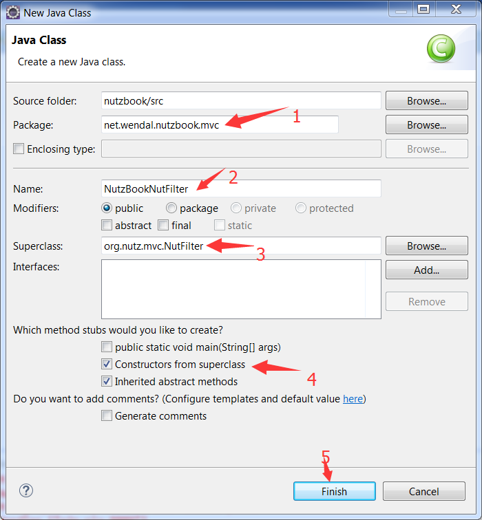

# 自定义NutFilter

### 这一小节,我们需要继承一下NutFilter,加点小判断

## 新建一个类, 叫NutzBookNutFilter,包名是net.wendal.nutzbook.mvc,超类是org.nutz.mvc.NutFilter



## 整个类的代码如下

```java
package net.wendal.nutzbook.mvc;

import java.io.IOException;
import java.util.HashSet;
import java.util.Set;

import javax.servlet.FilterChain;
import javax.servlet.FilterConfig;
import javax.servlet.ServletException;
import javax.servlet.ServletRequest;
import javax.servlet.ServletResponse;
import javax.servlet.http.HttpServletRequest;

import org.nutz.mvc.NutFilter;

public class NutzBookNutFilter extends NutFilter {
	
	protected Set<String> prefixs = new HashSet<String>();
	
	
	public void init(FilterConfig conf) throws ServletException {
		super.init(conf);
		prefixs.add(conf.getServletContext().getContextPath() + "/druid/");
		prefixs.add(conf.getServletContext().getContextPath() + "/rs/");
	}

	@Override
	public void doFilter(ServletRequest req, ServletResponse resp, FilterChain chain) throws IOException, ServletException {
		if (req instanceof HttpServletRequest) {
			String uri = ((HttpServletRequest) req).getRequestURI();
			for (String prefix : prefixs) {
				if (uri.startsWith(prefix)) {
					chain.doFilter(req, resp);
					return;
				}
			}
		}
		super.doFilter(req, resp, chain);
	}
}

```

### 含义是, 如果访问/druid或/rs下的路径,就无条件跳过NutFilter

### 然后,打开web.xml, 将其中的org.nutz.mvc.NutFilter改成net.wendal.nutzbook.mvc.NutzBookNutFilter

```xml
	<filter>
		<filter-name>nutz</filter-name>
		<filter-class>net.wendal.nutzbook.mvc.NutzBookNutFilter</filter-class>
		<init-param>
			<param-name>modules</param-name>
			<param-value>net.wendal.nutzbook.MainModule</param-value>
		</init-param>
	</filter>
```

## 启动tomcat, 访问如下地址, 应该druid的监控页面就会出来,然后后台无nutz的log输出

```
http://127.0.0.1:8080/nutzbook/druid/index.html
```

