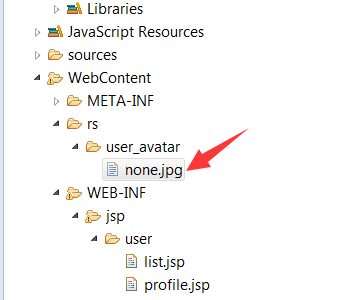

# 用户详情页

## 首先, 先找个默认头像的文件

* 下载 https://cn.gravatar.com/avatar/
* 或者直接从这里另存为 
* 或者你自行找个喜欢的头像文件呗

## 将none.jpg放入 WebContent/rs/user_avatar/none.jpg



## 打开UserProfileModule类,加入一个方法, 用于内部跳转到profile.jsp

```java
	@At("/")
	@GET
	@Ok("jsp:jsp.user.profile")
	public UserProfile index(@Attr(scope=Scope.SESSION, value="me")int userId) {
		return get(userId);
	}
```

## 新建一个jsp文件 WebContent/WEB-INF/jsp/user/profile.jsp

```jsp
<%@ page language="java" contentType="text/html; charset=UTF-8"
	pageEncoding="UTF-8" trimDirectiveWhitespaces="true"%>
<%@ taglib uri="http://java.sun.com/jsp/jstl/core" prefix="c"%>
<!DOCTYPE html PUBLIC "-//W3C//DTD HTML 4.01 Transitional//EN" "http://www.w3.org/TR/html4/loose.dtd">
<html>
<head>
<meta http-equiv="Content-Type" content="text/html; charset=UTF-8">
<title>用户详情页</title>
<script type="text/javascript"
	src="http://cdn.staticfile.org/jquery/1.8.3/jquery.min.js"></script>
<script type="text/javascript">
	var base = '${base}';
	$.fn.serializeObject = function() {
		var o = {};
		var a = this.serializeArray();
		$.each(a, function() {
			if (o[this.name] !== undefined) {
				if (!o[this.name].push) {
					o[this.name] = [ o[this.name] ];
				}
				o[this.name].push(this.value || '');
			} else {
				o[this.name] = this.value || '';
			}
		});
		return o;
	};
	$(function() {
		$("#user_profile_btn").click(function() {
			//alert(JSON.stringify($("#user_profile").serializeObject()));
			$.ajax({
				url : base + "/user/profile/update",
				type : "POST",
				data : JSON.stringify($("#user_profile").serializeObject()),
				success : function() {
					location.reload();
				}
			});
		});
	});
</script>
</head>
<body>
	<div>
		<div>
			头像 
			<p />
			<form action="${base}/user/profile/avatar" method="post"
				enctype="multipart/form-data">
				头像文件 <input type="file" name="file">
				<button type="submit">更新头像</button>
			</form>
			<span class="color:#f00"> <%
 	if (session.getAttribute("upload-error-msg") != null) {
 		String msg = session.getAttribute("upload-error-msg")
 				.toString();
 		out.print(msg);
 		session.removeAttribute("upload-error-msg");
 	}
 %>
			</span><p />
		</div>
	</div>
	<div>
		<form action="#" id="user_profile" method="post">
			<div>
				id:<c:out value="${obj.userId}"></c:out><p />
			</div>
			<div>
				昵称:<input name="nickname" value="${obj.nickname}"><p />
			</div>
			<div>
				邮箱:<input name="email" value="${obj.email}">
				<p />
			</div>
			<div>
				邮箱验证状态:<c:out value="${obj.emailChecked}"></c:out><p />
			</div>
			<div>
				性别:<input name="gender" value="${obj.gender}"><p />
			</div>
			<div>
				自我介绍:<input name="description" value="${obj.description}"><p />
			</div>
			<div>
				地理位置:<input name="location" value="${obj.location}"><p />
			</div>
		</form>
		<button type="button" id="user_profile_btn">更新</button>
	</div>
</body>
</html>
```

### 文件很长,当然也很丑,也许后期会把UI弄好一点,现在先凑合着看吧.

## 关于文件上传

* 直接ajax上传是不行的, 那是html4的限制,不是nutz的问题
* swfupload等等都可以用的,因为发送的格式都是html multipart
* UploadAdaptor管理的是*临时*文件夹!!需要自行把文件移动到需要的目录去,或者扔到数据库去