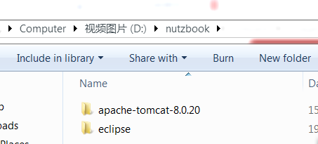
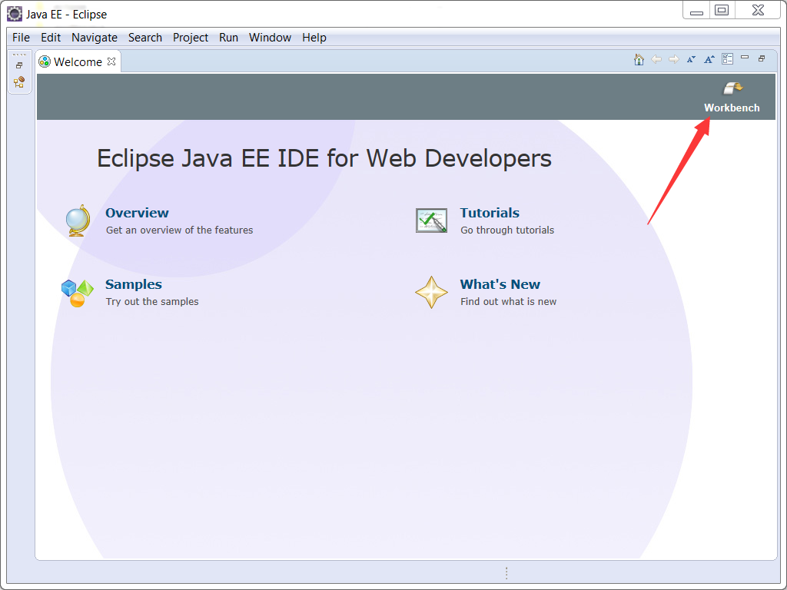

# 选用工具

本书基于Eclipse,Nutz,Mysql,Tomcat这4款基本工具

### 存放工程及工具的目录

* 请在D盘或你喜欢的目录下建一个叫nutzbook的空文件夹
* 除JDK和Mysql外的工具均会解压到该目录

### Java Platform (JDK)

* [Java下载官网](http://www.oracle.com/technetwork/java/javase/downloads/index.html)
* 请选用当前最新的版本,根据平台选用X64或X86版本的JDK8,并妥善安装

### 数据库 Mysql

* [Mysql官网](http://mysql.org/)
* [下载页面](http://dev.mysql.com/downloads/), 选用5.6系列的最新版
* 妥善安装,并设置密码为root

### 开发工具 Eclipse 

* [Eclipse官网](http://eclipse.org/)
* 选用当前最新的4.4.2, [下载地址](http://www.eclipse.org/downloads/), JavaEE版
* 请根据Jdk版本选用对应的版本, 并解压到nutzbook目录
* 文件大小约254mb

### Web容器 Tomcat

* [Tomcat 官网](http://tomcat.apache.org/)
* [下载页面](http://tomcat.apache.org/download-80.cgi),选取Tomcat 8.x系列最新版
* 解压到nutzbook目录
* 文件大小约10mb

### 完成后的目录截图

### Java版本截图

### Eclipse 启动截图

在nutzbook/eclipse目录中双击eclipse.exe启动eclipse

在对话框中填入/选择nutzbook/workspace目录的路径, 并勾选为默认值

### Eclipse进入工作区

### Eclipse最终效果

