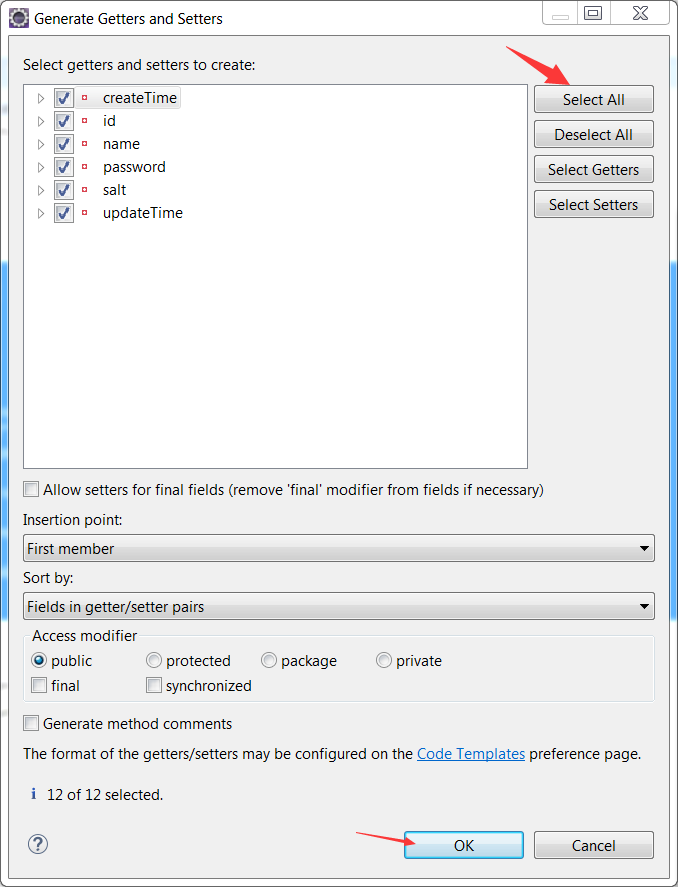

# 新增Pojo

## 添加第一个Pojo类, 用户User, 按Ctrl+N,选择Class,弹出新建类对话框,输入package和类名


## 为User类添加几个属性

```
package net.wendal.nutzbook.bean;

import java.util.Date;

public class User {

	private int id;
	private String name;
	private String password;
	private String salt;
	private Date createTime;
	private Date updateTime;
}

```

## 标注Nutz所需的注解Table,Id,Name

```
@Table("t_user")
public class User {

	@Id
	private int id;
	@Name
	@Column
	private String name;
	@Column("passwd")
	private String password;
	@Column
	private String salt;
	@Column("ct")
	private Date createTime;
	@Column("ut")
	private Date updateTime;
	
}

```

## 在菜单中选择Sources--Generate Getters and Setters,点击Select All, 完成OK



## 最终效果的User.java 完整代码

```
package net.wendal.nutzbook.bean;

import java.util.Date;

import org.nutz.dao.entity.annotation.Column;
import org.nutz.dao.entity.annotation.Id;
import org.nutz.dao.entity.annotation.Name;
import org.nutz.dao.entity.annotation.Table;

@Table("t_user")
public class User {

	@Id
	private int id;
	@Name
	@Column
	private String name;
	@Column("passwd")
	private String password;
	@Column
	private String salt;
	@Column("ct")
	private Date createTime;
	@Column("ut")
	private Date updateTime;
	public int getId() {
		return id;
	}
	public void setId(int id) {
		this.id = id;
	}
	public String getName() {
		return name;
	}
	public void setName(String name) {
		this.name = name;
	}
	public String getPassword() {
		return password;
	}
	public void setPassword(String password) {
		this.password = password;
	}
	public String getSalt() {
		return salt;
	}
	public void setSalt(String salt) {
		this.salt = salt;
	}
	public Date getCreateTime() {
		return createTime;
	}
	public void setCreateTime(Date createTime) {
		this.createTime = createTime;
	}
	public Date getUpdateTime() {
		return updateTime;
	}
	public void setUpdateTime(Date updateTime) {
		this.updateTime = updateTime;
	}
	
}

```

## 手册关联(选修)

* [注解列表](http://nutzam.com/core/dao/annotations.html)