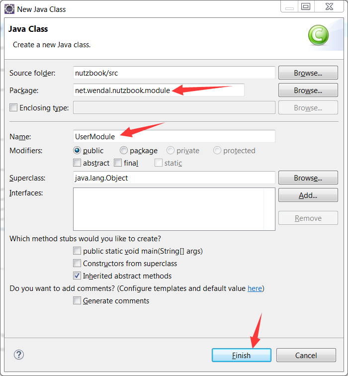

# 第一个模块类UserModule

## 新建一个类,名为UserModule, package为net.wendal.nutzbook.module



## 配置Ioc相关注解及属性,即IocBean,Inject和Dao属性,哦哦,还有At

完成的后的代码如下

```
package net.wendal.nutzbook.module;

import org.nutz.dao.Dao;
import org.nutz.ioc.loader.annotation.Inject;
import org.nutz.ioc.loader.annotation.IocBean;
import org.nutz.mvc.annotation.At;

@IocBean
@At("/user")
@Ok("json")
@Fail("http:500")
public class UserModule {

	@Inject
	protected Dao dao;
	
	
}
```

## 再加一个count方法, 测试用

整个类贴给你了

```
package net.wendal.nutzbook.module;

import net.wendal.nutzbook.bean.User;

import org.nutz.dao.Dao;
import org.nutz.ioc.loader.annotation.Inject;
import org.nutz.ioc.loader.annotation.IocBean;
import org.nutz.mvc.annotation.At;
import org.nutz.mvc.annotation.Fail;
import org.nutz.mvc.annotation.Ok;

@IocBean
@At("/user")
@Ok("json")
@Fail("http:500")
public class UserModule {

	@Inject
	protected Dao dao;
	
	@At
	public int count() {
		return dao.count(User.class);
	}
	
}


```

## 启动Tomcat,验证一下

启动tomcat后, 观察日志, 无异常的话, 在浏览器访问如下URL

```
http://127.0.0.1:8080/nutzbook/user/count
```

如果一切正常,那么会显示个1,就一个字符, 后台的log如下

```
2015-3-20 14:16:2.236 DEBUG [http-nio-8080-exec-2] Found mapping for [GET] path=/user/count : UserModule.count(...)
2015-3-20 14:16:2.238 DEBUG [http-nio-8080-exec-2] Get 'userModule'<class net.wendal.nutzbook.module.UserModule>
2015-3-20 14:16:2.238 DEBUG [http-nio-8080-exec-2] 	 >> Load definition
2015-3-20 14:16:2.238 DEBUG [http-nio-8080-exec-2] Found IocObject(userModule) in IocLoader(AnnotationIocLoader@406224233)
2015-3-20 14:16:2.238 DEBUG [http-nio-8080-exec-2] 	 >> Make...'userModule'<class net.wendal.nutzbook.module.UserModule>
2015-3-20 14:16:2.238 DEBUG [http-nio-8080-exec-2] class net.wendal.nutzbook.module.UserModule , no config to enable AOP for this type.
2015-3-20 14:16:2.239 DEBUG [http-nio-8080-exec-2] Save object 'userModule' to [app] 
2015-3-20 14:16:2.239 DEBUG [http-nio-8080-exec-2] Get 'dao'<>
2015-3-20 14:16:2.240 DEBUG [http-nio-8080-exec-2] SELECT COUNT(*) FROM t_user 
```

## 可能出现的问题:

```
Search mapping for path=/user/count : NOT Action match
```

 找不到方法, 一般是@At写错或者UserModule的package写错,导致映射不到或者根本没找到这个类